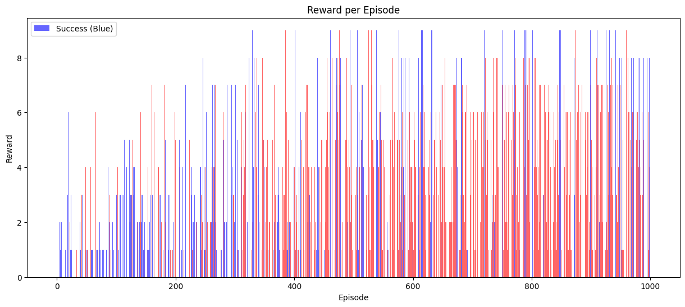
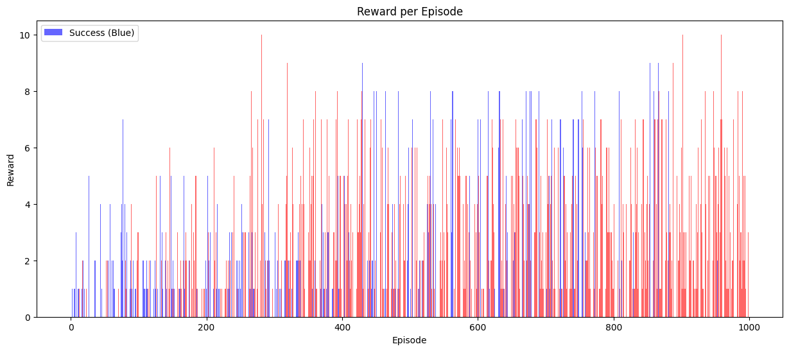
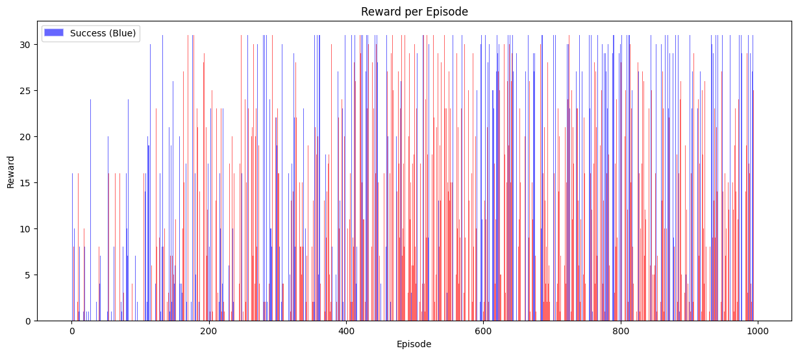

## 카드 뒤집기 게임 강화학습

### 1. 규칙
양의 정수 또는 'X'가 적힌 카드들이 있다. 플레이어는 무작위로 한 장씩 카드를 뒤집을 수 있다. 양의 정수가 적힌 카드를 뒤집으면 해당 숫자만큼 점수를 얻으며, 플레이어는 원하는 시점에 게임을 중단할 수 있다. 그러나 'X'가 적힌 카드를 뒤집으면 지금까지 얻은 모든 점수를 잃고 게임이 즉시 종료된다. 게임은 플레이어가 'X' 카드를 뒤집거나 스스로 중단을 선언할 때까지 진행되며, 목표는 가능한 많은 점수를 획득하는 것이다.

### 2. 게임 학습의 의의
이 카드 뒤집기 게임은 간단한 구조를 가지고 있음에도 불구하고, 강화학습 관점에서 매우 흥미로운 주제를 제공한다. 이 게임은 위험 회피와 보상 극대화 사이에서 균형을 학습하는 문제를 다루며, AI가 학습을 통해 예측하기 어려운 행동을 보일 가능성을 탐구할 수 있다. 특히, AI의 학습 과정에서 의사결정을 최적화하는 방식을 연구하기에 적합한 사례로 꼽힌다. 금융 의사결정(리스크 관리), 마케팅 전략, 안전 시스템 등에서 최대 이익을 추구하면서도 리스크를 최소화하려는 최적의 중단 시점을 모색하는 데 유용하다. 이를 통해 "최적의 의사결정은 무엇인가?"라는 강화학습의 근본적인 질문을 탐구할 수 있다.

### 3. 카드 상황별 최초 예상 결과
#### 3.1. $n$장의 '1'카드와 1장의 'X' 카드 조합인 상황
가장 먼저 다음 전략을 생각해볼 수 있다.
>고정된 $k$에 대해 처음 k장째까지는 무조건 카드를 계속해서 뒤집는다. 만약 $k$장을 모두 뒤집는 동안 'X' 카드가 한 장도 나오지 않았다면 $k+1$장째에서 무조건 게임을 중단한다.

이 경우 기댓값을 계산해 보면 다음과 같다.

처음 $k$장째를 뒤집는 동안 'X'카드가 한 장도 나오지 않을 확률

$$
\frac{n}{n+1} \times \frac{n-1}{n} \times \frac{n-2}{n-1} \times ... \times \frac{n-k+1}{n-k+2} = \frac{n-k+1}{n+1}
$$

처음 $k$장째를 뒤집는 동안 'X'카드가 한 장도 나오지 않으면 $k$점을 받고, 그 외에는 모두 0점을 받으므로 기댓값은

$$
\frac{n-k+1}{n+1} \times k = \frac{(n+1)k-k^2}{n+1}
$$

이다. 이때

$$
\frac{(n+1)k-k^2}{n+1} = \frac{-~(k- \frac{n+1}{2})^2 ~ + ~ \frac{(n+1)^2}{4}}{n+1}
$$

이므로 $n$이 홀수라면, $k= \frac{n+1}{2}$일 때, 기댓값이 $\frac{(n+1)^2}{4n+4}$점으로 최대가 된다. $n$이 짝수라면, 기댓값은 $\frac{n}{2}$일 때와 $\frac{n}{2} + 1$일 때, 각각 기댓값이 $\frac{n^2+2n}{4n+4}$점으로 최대이다.

이제 각 라운드에서 카드를 뒤집을지, 아니면 게임을 중단할지를 실시간으로 결정하기 위해, 매 순간 뒤집는 경우와 중단하는 경우의 점수 득실 기댓값을 비교해 보자. 여기서 $i$번째 카드를 뒤집는 상황을 $i$라운드라고 정의한다. 

$i$라운드에서는 이미 $i-1$점을 획득한 상태이다. 이때 게임을 중단하면, $i-1$점을 그대로 유지하며 게임을 종료한다. 반면, 카드를 뒤집는다면 다음과 같은 결과가 발생한다:
- '1' 카드를 뒤집을 경우, 1점을 추가로 얻는다.
- 'X' 카드를 뒤집을 경우, 지금까지 획득한 $i-1$점을 모두 잃는다.

$i$라운드에서 남은 카드의 장수는 $n+2-i$장이므로 $i$라운드에서 카드를 뒤집을 때 얻는 기댓값은 아래와 같이 계산된다.

$$
\frac{n+1-i}{n+2-i} \times 1 + \frac{1}{n+2-i} \times (-i+1) = \frac{n+2-2i}{n+2-i}
$$

따라서 $n+2-2i>0$일 때, 즉 $i<\frac{n+2}{2}$일 때에만 카드를 뒤집는 것이 유리하다. 따라서 최적의 진행 라운드 수는 위의 결과와 동일하게 나온다.

#### 3.2. 카드 조합의 일반화
숫자 카드 조합이 $a_1, a_2, ..., a_m$으로 $m$장 (이때, $a_1 + a_2 + ... + a_m = A$), 'X' 카드가 $n$장이라고 가정하자.
라운드 도중, 지금까지 획득한 점수가 $p$점, 남은 숫자 카드 조합이 $b_1, b_2, ..., b_k$인 상황을 생각해보자. 남은 카드 장수가 $k+n$장이고, $b_1 + b_2 + ... + b_k = A - p$이므로 이 상황에서 카드를 뒤집었을 때 획득하는 점수의 기댓값은 다음과 같다.

$$
\sum_{i=1}^{k} (\frac{1}{k+n} \times b_i) + \frac{n}{k+n} \times (-p) = \frac{(\sum_{i=1}^{k} b_i)}{k+n} + \frac{-pn}{k+n} = \frac{A - p}{k+n} + \frac{-np}{k+n} = \frac{A - (n+1)p}{k+n}
$$

따라서 지금까지 획득한 점수가 $\frac{A}{n+1}$점보다 작으면 카드를 뒤집는 것이 유리하고, $\frac{A}{n+1}$점보다 크면 카드를 더 이상 뒤집지 않고 중단하는 것이 유리하다. 만약 AI가 위험중립적이라고 가정한다면, 이러한 규칙에 의해 행동할 것으로 예측된다.

### 4. 강화학습 알고리즘 설계
**[환경 설명]**
카드 구성: 위의 ipynb 파일에서 '# 카드 세트'로 표시한 줄에 있는 빈 리스트 ([])에 카드 구성을 표시한다. 이때 숫자 카드는 int 혹은 float 형으로, X 카드는 str 형인 'X'로 넣는다.
상태: (현재 점수, 남은 카드 수, 남은 'X' 카드 수).
행동: [0: 그만두기, 1: 카드 뒤집기].
보상: 성공 시 누적 점수, 실패 시 0.

이 실험은 1000번 반복하여 최적의 알고리즘을 도출하는 과정이다. 각 반복에서 카드의 구성은 동일하게 유지되며, 10번의 시도마다 알고리즘을 학습 결과에 따라 업데이트한다. 1000번의 게임이 모두 종료되면, 결과는 다음과 같이 시각적으로 나타낸다. 각 시도에서 획득에 성공한 점수는 파란색 막대로 표시된다. 막대는 왼쪽에서 오른쪽으로 진행된 회수를 나타낸다. 만약 게임 도중 'X' 카드를 뒤집어서 종료되었다면, 'X' 카드를 뒤집기 직전의 점수를 표시하여 어느 구간에서 'X' 카드를 뒤집었는지를 보여주고, 이를 빨간색 막대로 표시하여 해당 점수가 획득에 실패했음을 보여준다. 또한 마지막 100번의 게임에서 이중 몇 번을 성공했는지와, 여기에서 획득한 평균 점수를 병기하여 결과를 더 알기 쉽게 한다.

#### 4.1. '1' 카드 9장, 'X' 카드 1장
이 경우 최적의 라운드 진행 숫자는 5라운드이다. 예상 성공 확률은 $\frac{1}{2}$이고, 예상 기대 점수는 5점임을 문단 3.1.에 의해 도출할 수 있다.

실제 결과는 위의 그래프와 같으며 마지막 100번의 게임 중 18번 성공, 기대 점수는 1.31점이다.

#### 4.2. '1' 카드 10장, 'X' 카드 2장
문단 3.2.에 의해 최적의 라운드 진행 숫자는 4라운드이다. 따라서 예상 성공 확률은 $\frac{10}{12} \times \frac{9}{11} \times \frac{8}{10} \times \frac{7}{9} = 0.4242...$, 예상 기대 점수는 1.6970...점이다.

하지만 실제 결과는 위의 그래프로 볼 수 있듯이 충격적이었다. 마지막 100번의 게임 중 단 1번만 성공했다. 기대 점수는 0.02점이다. 954번째 게임에서 단 2점 얻은 것이 전부였다. 심지어 기껏 '1' 카드 10장을 모두 뒤집고도 게임을 계속하고 'X'를 뒤집어 10점을 도로 날려버린 게임도 존재했다.

#### 4.3. '1', '2', '4', '8', '16', 'X' 카드 1장씩
이것은 성공/실패를 조금 더 정교하게 보기 위해 한 실험으로 문단 3.2.에 의해 16점 이상 획득, 즉 '16' 카드를 뽑아야 종료할 것으로 예측하여 설계하였다. 이에 따라 성공은 16점 이상 득점으로, 실패면 15점 이하로 그래프가 그려져, 16점을 기준으로 그래프가 이분화될 것으로 기대하고 만들어낸 실험이다.

마지막 100번의 게임 중 25번 성공, 기대 점수는 7.00점이다.

### 5. 강화학습 실패 원인
예상보다 성공 횟수와 평균 점수가 매우 저조하게 나왔다. 이는 AI가 예측했던 라운드보다 지나치게 많은 라운드를 진행하며 위험한 플레이를 선택한 결과로, 'X' 카드를 지나치게 많이 뽑게 된 것이 주요 원인이다. 이로 인해 해당 강화학습은 사실상 실패로 평가될 수 있다. 실패 원인을 ChatGPT로 문의해본 결과 ChatGPT는 주요 실패 원인을 다음과 같이 지적했다.
- 보상 설계의 부적절함: X를 뒤집었을 때 보상이 항상 0으로 설정되어 실패 상황과 점수 획득 상황 간 차이를 명확히 구분하지 못하였다. 이로 인해 에이전트가 "그만두기"의 중요성을 인식하지 못하고 과도하게 탐험하려는 경향이 생긴 듯하다. 실패했을 때 -10과 같은 명확한 페널티를 주었거나, 성공적으로 종료했을 때 추가적인 보상을 부여했다면 위험을 더 잘 회피할 가능성이 있었을 것이라고 지적받았다. 강화학습에서의 보상을 실제 피상적인 보상과 무조건 동일하게 설정하면 안 되는 듯했다.
- 상태 공간 정보의 부족: 상태 공간 설계가 단순해서 에이전트가 충분히 환경을 이해하지 못했을 가능성이 컸다. 현재 상태 (점수, 남은 카드 수, 남은 X 카드 수)는 정보가 부족해 미래 위험을 예측하기 어려웠다. 카드의 값 분포나 이미 뒤집힌 카드에 대한 정보가 포함되지 않아, 위험을 학습하는 데 필요한 데이터가 충분히 제공되지 않았다고 한다.
- 훈련 데이터의 제한: 카드 구성과 환경 조건이 매 게임마다 고정적이어서 학습 데이터의 다양성이 부족했다. 이에 학습 과정에서 모든 가능한 상황을 충분히 경험하지 못했다고 한다. 특정 상황에서 최선의 전략으로 수렴하는 것을 보기 위해 카드 구성을 고정한 것이 오히려 독으로 돌아온 것이다.

본 프로젝트는 제한된 시간 내에서 복잡한 환경과 적합한 알고리즘 설계가 어렵다는 점에서 강화학습의 실효성을 탐구하는 데 중요한 교훈을 제공하였다. 시간이 조금 더 있었다면 이를 보완할 방법도 조금 더 생각할 수 있었겠지만, 다른 과목 학습 등의 이유로 시간을 많이 확보하지 못해 아쉬웠다.
